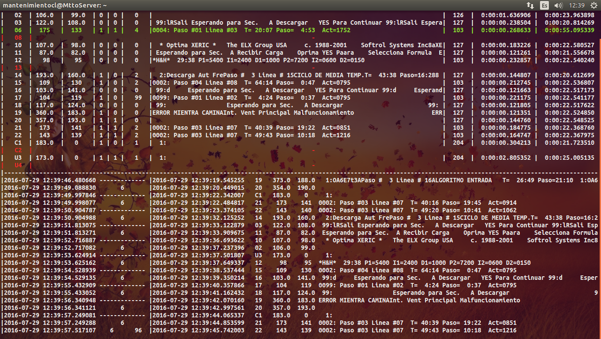
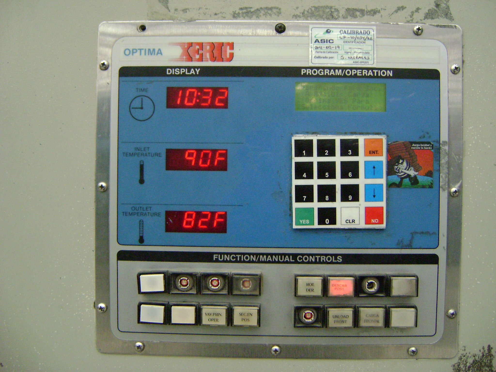
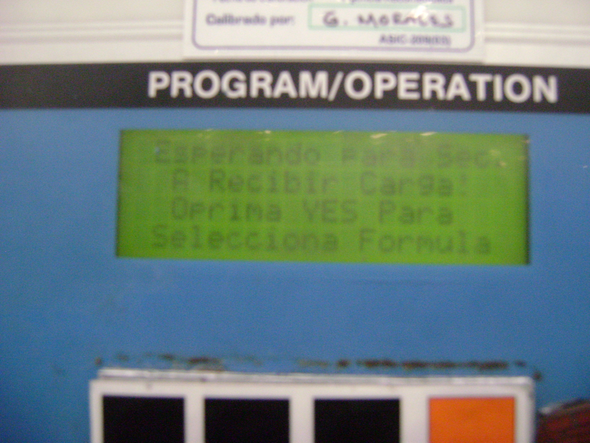
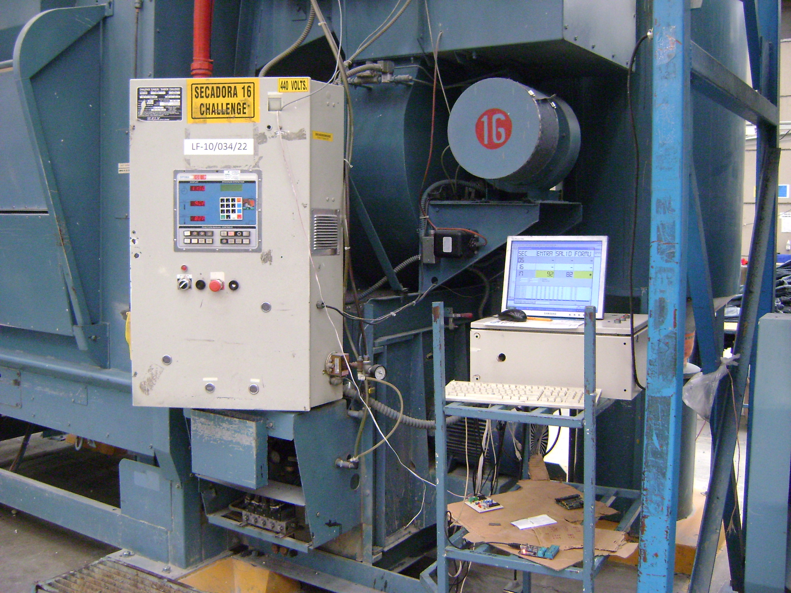
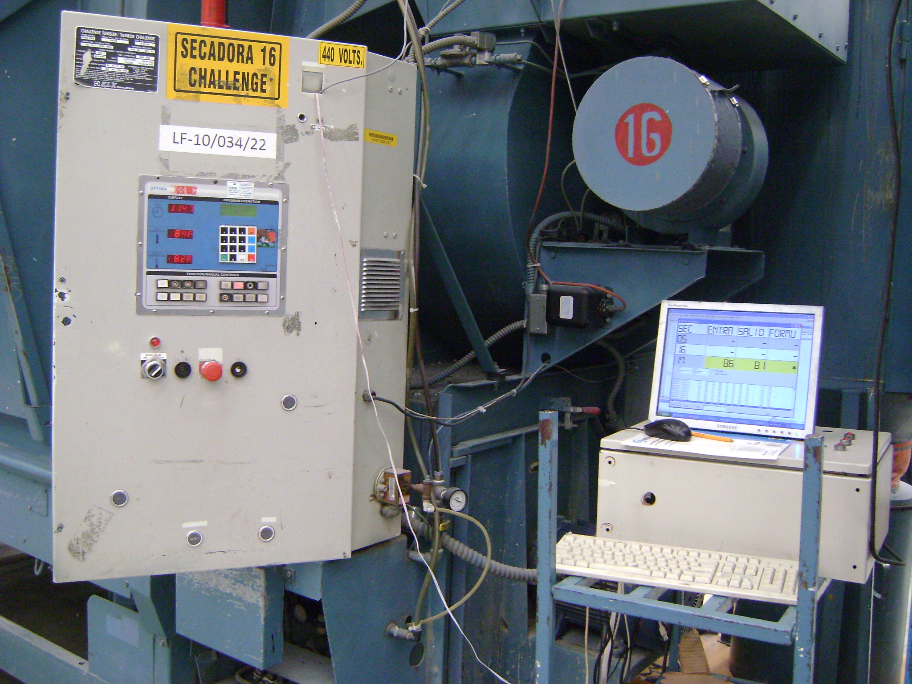
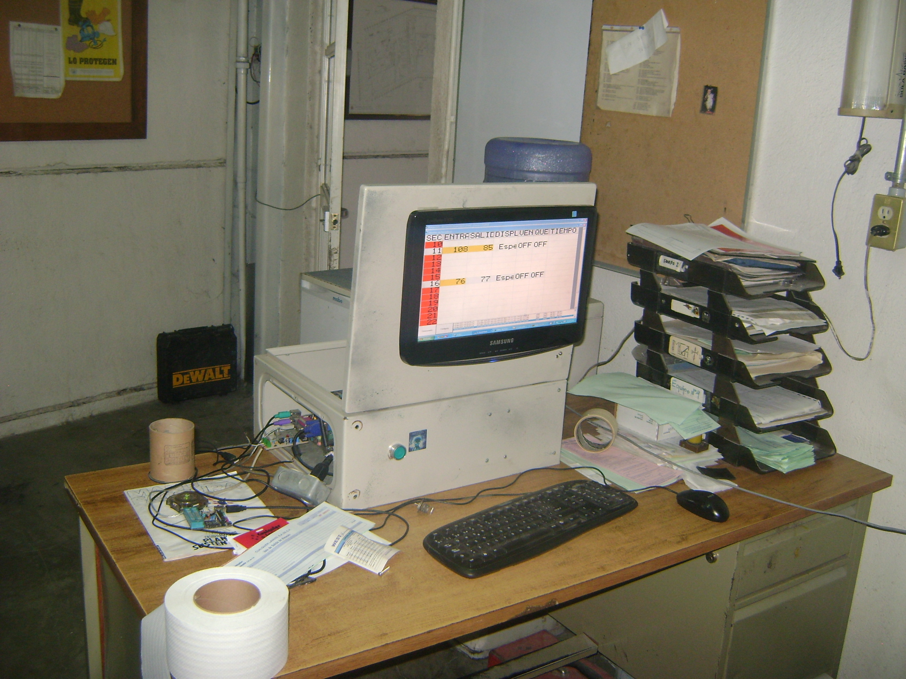
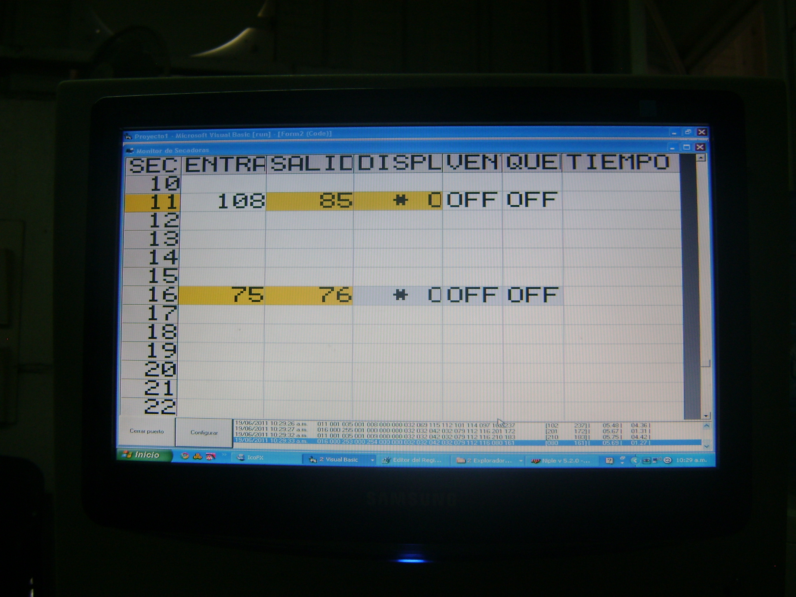
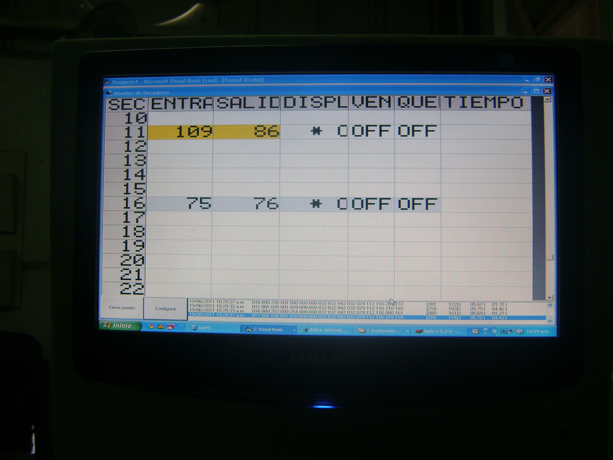
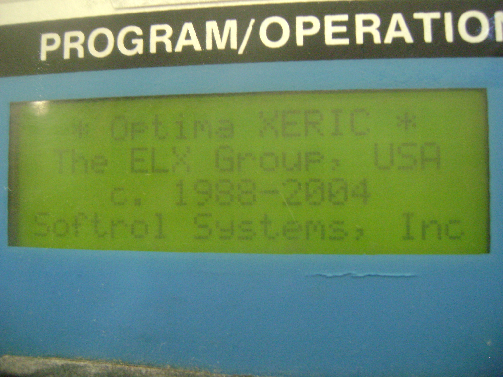
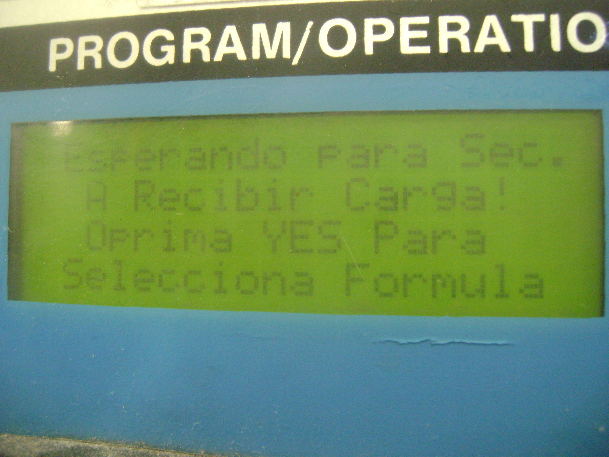

 

  

 

# MonitorSecadoras

## Fecha
* 2013

## Descripcion del proyecto
* Programa que se comunica con los esclavos de una red RS485 para obtener los datos y guardarlos en un servidor de base de datos.

## Herramientas utilizadas
* Python 3
* MySQL 5.8

## Modelos de PLC, etc.
* Tarjetas H&H para secadora challenge
* PLC LS MasterK 120S con programa de secadoras H&H

## Autores
* <a href="https://github.com/emmanuel156">emmanuel156</a> 
* <a href="http://www.github.com/pedrohermon">pedrohermon</a> 

## Comentarios
* Ninguno

## Contenido
* Carpeta de Pruebas
	* Pruebas preliminares del proyecto
		* Programas incompletos, o secciones de programas
		* Capturas de comunicacion
		* Modelos de componentes que se hayan probado
* Carpeta de Programas
	* Programas de Computadora, PLC, etc. 
		* Codigos fuente.
		* Iconos e imagenes usados en los programas.
		* Archivos de configuracion de los programas.
		* Programas compilados.
* Carpeta de Fotos
	* Fotos del proyecto antes, durante y despues del desarrollo del mismo
		* Fotos
		* Capturas de pantalla
* Carpeta de Diagramas
	* Diagramas del proyecto
		* Diagramas electricos
		* Diagramas de bloques
		* Dibujos
* Carpeta de Documentos
	* Documentos pensados para el usuario final
		* Manuales de usuario
		* Manuales de programacion
* Carpeta de Historial
	* Documentacion del desarrollo del proyecto
		* Hojas de datos de componentes
		* Manuales de usuario de componentes
		* Documentacion de funciones, herramientas

---

---

---

---

---

---

---

---

---

---

---

---

---

---

---

---

---

---

---

---

---

---

---

---

---

---

---

---

---

